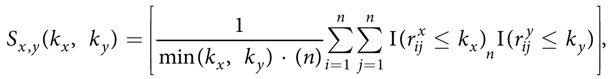
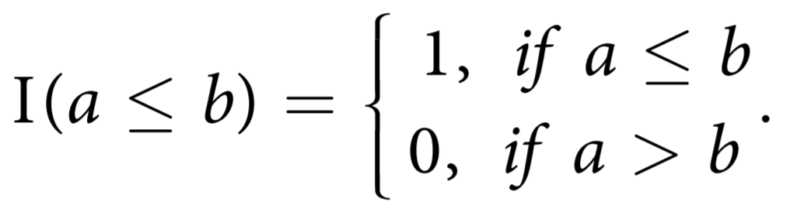
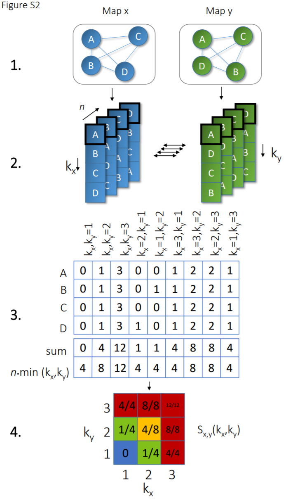

Method
###########################

To compare the embedding of samples in two different maps, we propose a scale dependent similarity measure. For a pair of maps X and Y, we compare the sets of the, respectively, kx and ky nearest neighbours of each sample. We first define the variable rxij as the rank of the distance of sample j among all samples with respect to sample i, in map X. The nearest neighbor of sample i will have rank 1, the second nearest neighbor rank 2, etc. Analogously, ryij is the rank of sample j with respect to sample i in map Y. Now we define a score on the interval [0, 1], as (eq. 1)

where the variable n is the total number of samples, and the indicator function is given by (eq. 2)

The score sx,y(kx, ky) will have value 1 if, for each sample, all kx nearest neighbours in map X are also the ky nearest neighbours in map Y, or vice versa. Note that a local neighborhood of samples can be set on the minimum number of samples in the class. Alternatively, kxy can be also set on the average class size.

Schematic overview
###########################

Schematic overview to systematically compare local and global differences between two sample projections. For illustration we compare two input maps (x and y) in which each map contains n samples (step 1). The second step is the ranking of samples based on Euclidean distance. The ranks of map x are subsequently compared to the ranks of map y for kx and ky nearest neighbours (step 3). The overlap between ranks (step 4), is subsequently summarized in Score: Sx,y(kx,ky).

.. raw:: html

	

	

		
	

	

