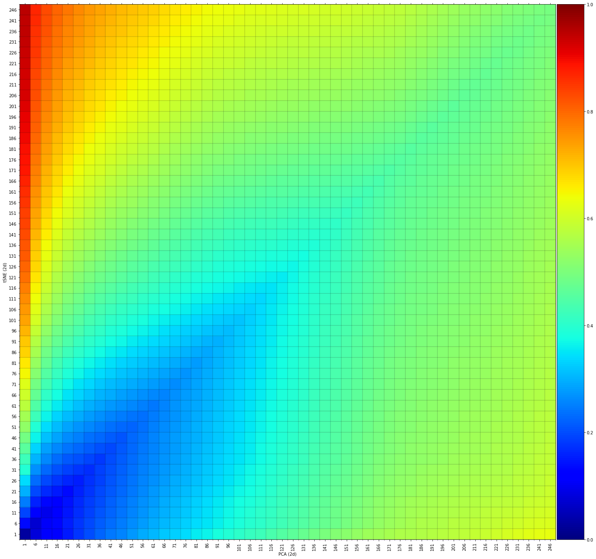

KNRscore's documentation!
==============================

|python| |pypi| |docs| |stars| |LOC| |downloads_month| |downloads_total| |license| |forks| |open issues| |project status| |medium| |colab| |DOI| |repo-size| |donate|

-----------------------------------

``KNRscore`` is a Python package for the comparison of high dimensional embeddings using a scale dependent similarity measure.
With KNRscore you can quantify the local similarities across two maps or embeddings, such as PCA and t-SNE or with the original high dimensional data.

.. tip::
	`Blog (Medium): Quantitative comparisons between t-SNE, UMAP, PCA, and Other Mappings. <https://towardsdatascience.com/the-similarity-between-t-sne-umap-pca-and-other-mappings-c6453b80f303>`_

-----------------------------------

.. note::
	**Your ❤️ is important to keep maintaining this package.** You can `support <https://erdogant.github.io/KNRscore/pages/html/Documentation.html>`_ in various ways, have a look at the `sponser page <https://erdogant.github.io/KNRscore/pages/html/Documentation.html>`_.
	Report bugs, issues and feature extensions at `github <https://github.com/erdogant/KNRscore/>`_ page.

	.. code-block:: console

	   pip install KNRscore

-----------------------------------

Content
=======

.. toctree::
   :maxdepth: 1
   :caption: Method
   
   Background

.. toctree::
   :maxdepth: 1
   :caption: Installation
   
   Installation

.. toctree::
  :maxdepth: 1
  :caption: Tutorials

  Tutorials

.. toctree::
  :maxdepth: 1
  :caption: Examples

  Examples

.. toctree::
  :maxdepth: 1
  :caption: Documentation
  
  Documentation
  Coding quality
  KNRscore.KNRscore

* :ref:`genindex`

Indices and tables
==================

* :ref:`genindex`
* :ref:`modindex`
* :ref:`search`

.. |python| image:: https://img.shields.io/pypi/pyversions/KNRscore.svg
    :alt: |Python
    :target: https://erdogant.github.io/KNRscore/

.. |pypi| image:: https://img.shields.io/pypi/v/KNRscore.svg
    :alt: |Python Version
    :target: https://pypi.org/project/KNRscore/

.. |docs| image:: https://img.shields.io/badge/Sphinx-Docs-blue.svg
    :alt: Sphinx documentation
    :target: https://erdogant.github.io/KNRscore/

.. |stars| image:: https://img.shields.io/github/stars/erdogant/KNRscore
    :alt: Stars
    :target: https://img.shields.io/github/stars/erdogant/KNRscore

.. |LOC| image:: https://sloc.xyz/github/erdogant/KNRscore/?category=code
    :alt: lines of code
    :target: https://github.com/erdogant/KNRscore

.. |downloads_month| image:: https://static.pepy.tech/personalized-badge/KNRscore?period=month&units=international_system&left_color=grey&right_color=brightgreen&left_text=PyPI%20downloads/month
    :alt: Downloads per month
    :target: https://pepy.tech/project/KNRscore

.. |downloads_total| image:: https://static.pepy.tech/personalized-badge/KNRscore?period=total&units=international_system&left_color=grey&right_color=brightgreen&left_text=Downloads
    :alt: Downloads in total
    :target: https://pepy.tech/project/KNRscore

.. |license| image:: https://img.shields.io/badge/license-MIT-green.svg
    :alt: License
    :target: https://github.com/erdogant/KNRscore/blob/master/LICENSE

.. |forks| image:: https://img.shields.io/github/forks/erdogant/KNRscore.svg
    :alt: Github Forks
    :target: https://github.com/erdogant/KNRscore/network

.. |open issues| image:: https://img.shields.io/github/issues/erdogant/KNRscore.svg
    :alt: Open Issues
    :target: https://github.com/erdogant/KNRscore/issues

.. |project status| image:: http://www.repostatus.org/badges/latest/active.svg
    :alt: Project Status
    :target: http://www.repostatus.org/#active

.. |medium| image:: https://img.shields.io/badge/Medium-Blog-green.svg
    :alt: Medium Blog
    :target: https://erdogant.github.io/KNRscore/pages/html/Documentation.html#medium-blog

.. |donate| image:: https://img.shields.io/badge/Support%20this%20project-grey.svg?logo=github%20sponsors
    :alt: donate
    :target: https://erdogant.github.io/KNRscore/pages/html/Documentation.html#

.. |colab| image:: https://colab.research.google.com/assets/colab-badge.svg
    :alt: Colab example
    :target: https://erdogant.github.io/KNRscore/pages/html/Documentation.html#colab-notebook

.. |DOI| image:: https://zenodo.org/badge/234703853.svg
    :alt: Cite
    :target: https://zenodo.org/badge/latestdoi/234703853

.. |repo-size| image:: https://img.shields.io/github/repo-size/erdogant/KNRscore
    :alt: repo-size
    :target: https://img.shields.io/github/repo-size/erdogant/KNRscore

.. include:: add_bottom.add
